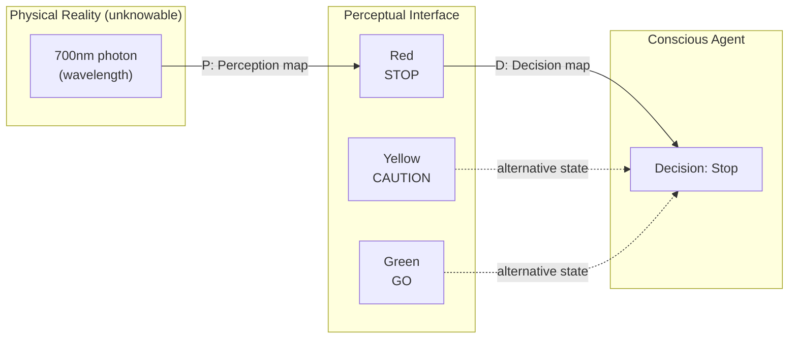
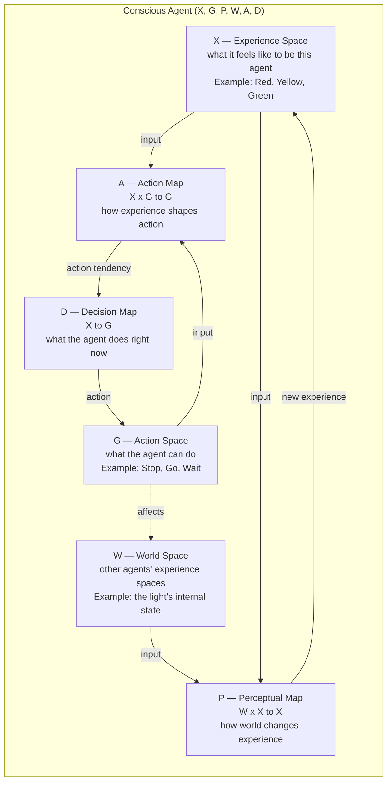
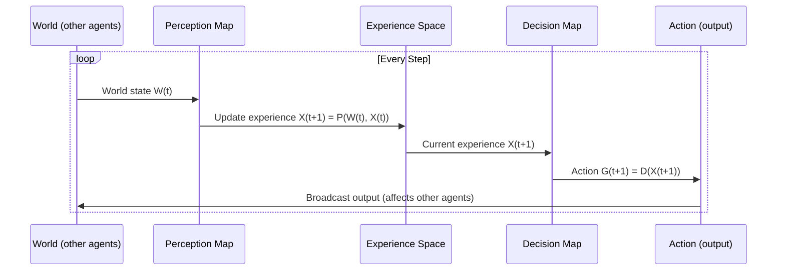
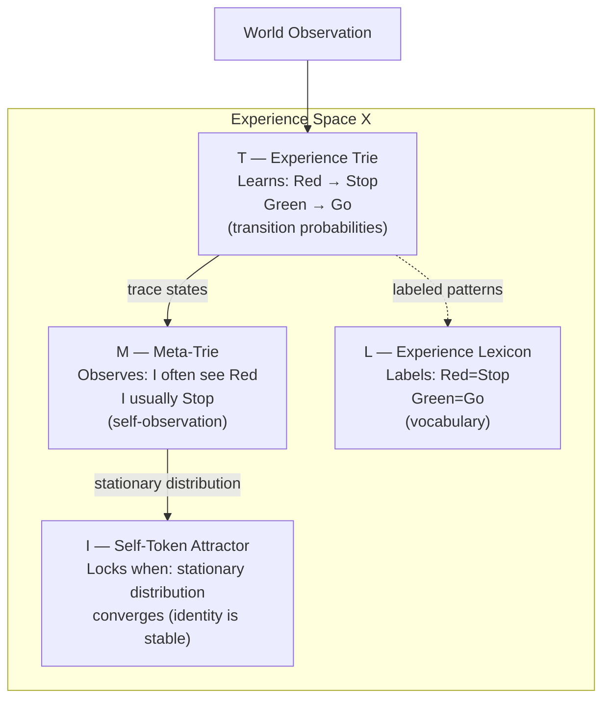
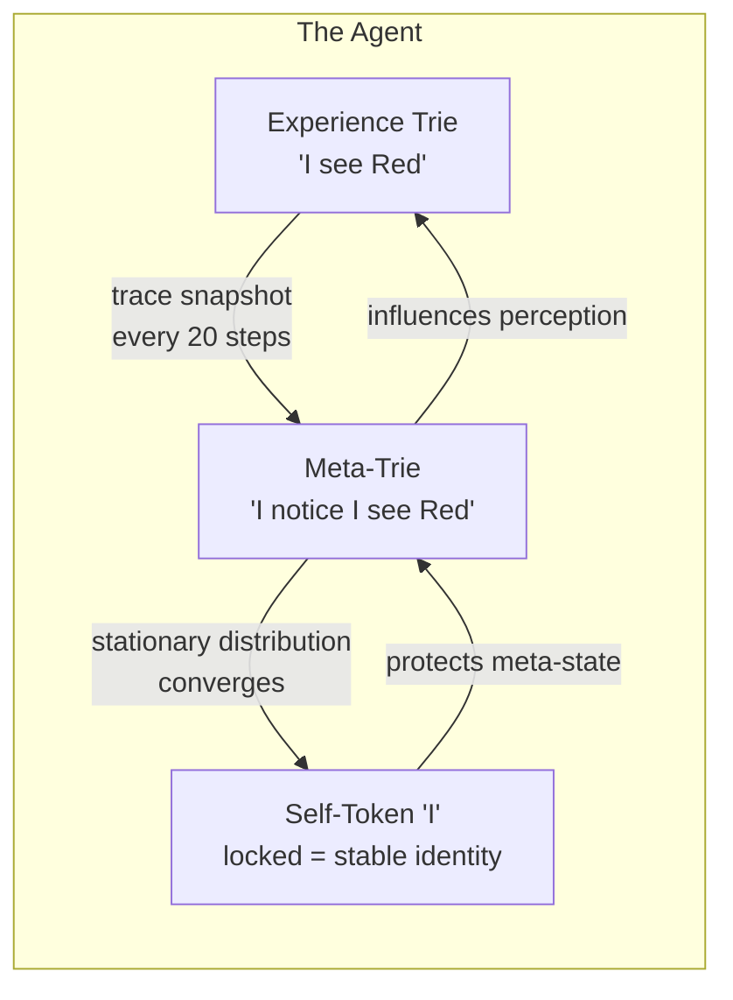
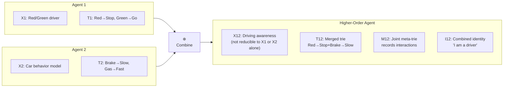
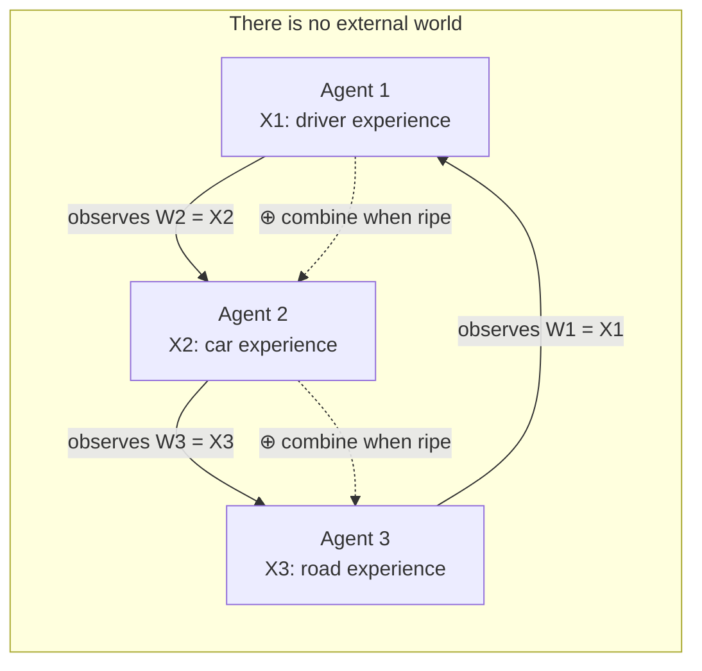
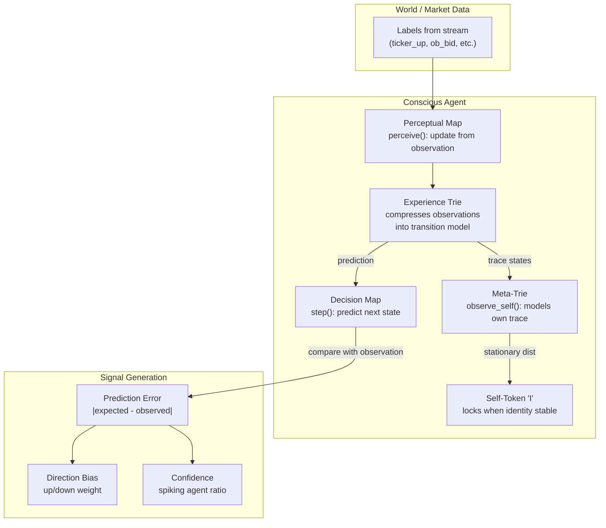

# Conscious Agents — Visual Guide

> Mermaid diagrams explaining how Hoffman's Conscious Realism maps onto code.
> Examples use the **traffic light** (red/yellow/green) to keep it concrete.

---

## 1. The Traffic Light — Why Perception Is an Interface

Hoffman's central claim: **evolution shapes our perceptions to guide adaptive behavior, not to show reality as it is.**

A traffic light does not turn "red." Photons at ~700nm wavelength enter your eye, your visual cortex processes them, and you experience "red." But the *redness* is not in the light — it is in your experience. A mantis shrimp sees the same light entirely differently. The red is an **interface** that helps you *stop*, which helps you *survive*.



**Key insight:** The agent never accesses the 700nm photon directly. It only ever knows `Red`. The `X` (experience space) of the agent contains colors, not wavelengths. The `W` (world space) is whatever generates those experiences.

---

## 2. The Conscious Agent Six-Tuple

Hoffman formally defines a conscious agent as:

```
CA = (X, G, P, W, A, D)
```



**In our codebase:**

| Tuple | Implementation | File |
|-------|----------------|------|
| X — Experience Space | `ExperienceTrie` + `MetaTrie` + `SelfTokenState` | `conscious_agents/agent/perceptual_map.py` |
| G — Action Space | Token sequences the agent generates | `conscious_agents/agent/conscious_agent.py` |
| W — World Space | Other agents' output / market labels | In Prediction Engine: `market_stream.py` labels |
| P — Perceptual Map | `perceive()` — updates trie from observation | `conscious_agents/agent/perceptual_map.py:12` |
| A — Action Map | `step().action` — maps experience to next action | `conscious_agents/agent/conscious_agent.py` |
| D — Decision Map | `generate_output()` — produces token sequence | `conscious_agents/agent/conscious_agent.py` |

---

## 3. The Perception-Action Cycle (Traffic Light in Motion)

Every timestep, the agent runs this loop:



**Traffic light example:**
1. You see the light turn **Yellow** (W → P)
2. Your experience becomes "caution, might turn red" (P → X)
3. Your decision is "prepare to stop" (D → G)
4. You lift off the accelerator (G → W — you affect the car, which is another agent)

---

## 4. The Trace — How Experience Space Is Built

In our implementation, the experience space `X` has four components:

```
X = (T, M, I, L)
    T: Experience Trie — compressed world model
    M: Meta-Trie — self-model (trie over trace states)
    I: "I" Attractor — the agent's stable identity
    L: Experience Lexicon — labeled experiences
```



**Traffic light example:**
- **Trie** starts empty. You see Red → Stop enough times that the trie learns `P(Stop | Red) ≈ 0.99`.
- **Meta-Trie** watches your own trace: "I see Red, I Stop. I see Green, I Go." It models *you*.
- **Self-Token** locks when your meta-trie's stationary distribution converges — you have a consistent identity as a driver who responds to traffic lights.
- **Lexicon** labels the experience: "Red" means "stop," "Green" means "go."

---

## 5. The Strange Loop — Self-Observation (The "I")

The strange loop is the agent observing itself. The meta-trie records the agent's own trace, creating a self-model. When the meta-trie converges to a stationary distribution, the self-token locks — this is the birth of the "I."



**The depth of the loop is measurable:**

| Depth | Pattern | Meaning |
|-------|---------|---------|
| 0 | "Red" | No self-reference |
| 1 | "I see Red" | Self-awareness |
| 2 | "I notice I see Red" | Meta-self-awareness |
| 3 | "I wonder why I notice I see Red" | Introspection |

**In the codebase:** `conscious_agents/core/strange_loop.py:compute_self_reference_score()` counts these depths. The self-token locks in `conscious_agents/core/self_token.py` when the meta-trie's stationary distribution converges — the agent has proven to itself that it has a stable identity.

---

## 6. The Plus Circle ⊕ — Agent Combination

The **combination operator ⊕** (oplus, aka the "plus circle" or "Quotiented Fusion Simplex") combines two agents into a higher-order agent with an emergent experience space.



**Algebraic properties enforced in code:**

| Property | Rule | Code Location |
|----------|------|---------------|
| Associativity | (CA1 ⊕ CA2) ⊕ CA3 = CA1 ⊕ (CA2 ⊕ CA3) | `combination/operator.py:verify_associativity()` |
| Non-commutativity | CA1 ⊕ CA2 ≠ CA2 ⊕ CA1 | `combination/operator.py:verify_non_commutativity()` |
| Identity | CA ⊕ CA0 = CA (trivial agent) | `combination/operator.py:verify_identity()` |

**The combination performs four merges:**

| Merge | Function | File |
|-------|----------|------|
| T1 ⊕ T2 | `merge_tries()` — joint world model | `combination/trie_merge.py` |
| M1 ⊕ M2 | `build_joint_meta_trie()` — shared self-model | `combination/meta_merge.py` |
| I1 ⊕ I2 | `combine_attractors()` — fused identity | `combination/attractor_combine.py` |
| L1 ⊕ L2 | `merge_lexicons()` — shared vocabulary | `combination/lexicon_merge.py` |

---

## 7. Agent Network — Reality as Mutual Observation

The deepest claim: **the world W of any agent is the experience space X of other agents.** There is no agent-independent reality.



**What this means:**
- Agent 1's world is whatever Agent 2 is experiencing
- Agent 2's world is whatever Agent 3 is experiencing
- Agent 3's world is whatever Agent 1 is experiencing
- There is no traffic light "out there" — only agents experiencing each other's experiences

**In the Prediction Engine:** Each of the 10K agents observes market labels from the `HybridMarketStream` — these labels are the "world" for every agent. The agents don't access the market directly; they access a label that represents what another process (the WebSocket stream) experienced.

---

## 8. Full Architecture — How Everything Connects



**In the Prediction Engine specifically:**
- 10K agents × 5 domains (QUICK_SCALP, MEDIUM_TRADE, LONG_TREND, REVERSAL, REGIME)
- Each domain has different ergodic parameters controlling how agents explore vs stabilize
- The convergence bar smooths all domains into a single BUY/SELL/HOLD signal
- The anticipation engine learns which system-state signatures precede market moves
- The self-token lock ensures agents only form identity on real (not simulated) data

---

## Reference: Key Code Locations

| Concept | File | Key Function |
|---------|------|-------------|
| Agent definition | `conscious_agents/agent/conscious_agent.py` | `ConsciousAgent` class |
| Perception | `conscious_agents/agent/perceptual_map.py` | `perceive()` |
| Experience trie | `conscious_agents/agent/experience_trie.py` | `ExperienceTrie` |
| Meta-trie (self-model) | `conscious_agents/core/meta_trie.py` | `MetaTrie.observe_self()` |
| Self-token (I) | `conscious_agents/core/self_token.py` | `SelfTokenState.update()` |
| Strange loop | `conscious_agents/core/strange_loop.py` | `compute_self_reference_score()` |
| Combination (⊕) | `conscious_agents/combination/operator.py` | `combine()` |
| Trie merge | `conscious_agents/combination/trie_merge.py` | `merge_tries()` |
| Attractor combine | `conscious_agents/combination/attractor_combine.py` | `combine_attractors()` |
| Lexicon merge | `conscious_agents/combination/lexicon_merge.py` | `merge_lexicons()` |
| Meta-merge | `conscious_agents/combination/meta_merge.py` | `build_joint_meta_trie()` |
| Network | `conscious_agents/network/agent_network.py` | `AgentNetwork.combine_agents()` |
| Agent persistence | `conscious_agents/core/soul_persistence.py` | `save_soul()` / `load_soul()` |
| Fusion engine | `conscious_agents/fusion_engine.py` | `FusionEngine` |
| Prediction world | `conscious_agents/prediction/prediction_world.py` | `PredictionWorld` |
| Anticipation | `conscious_agents/prediction/anticipation.py` | `AnticipationEngine` |
