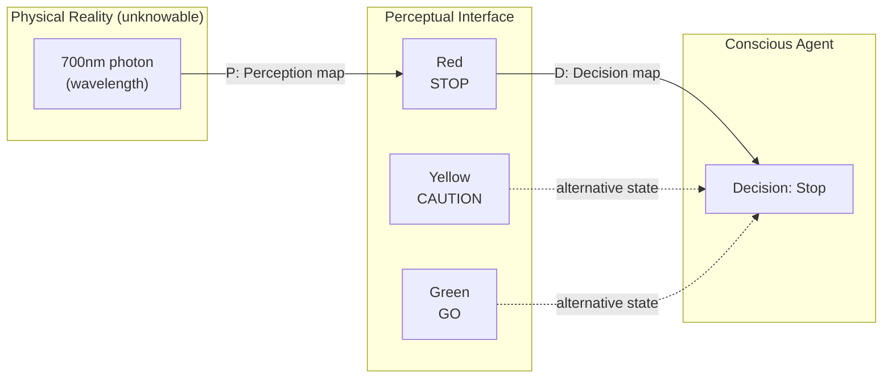
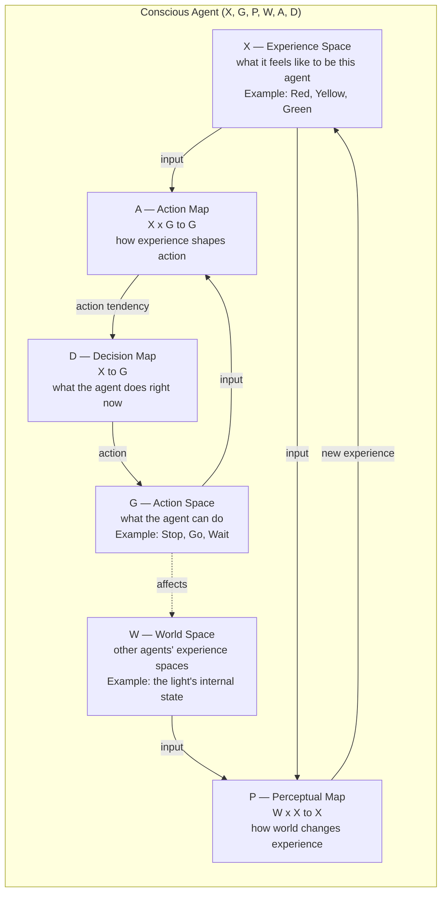
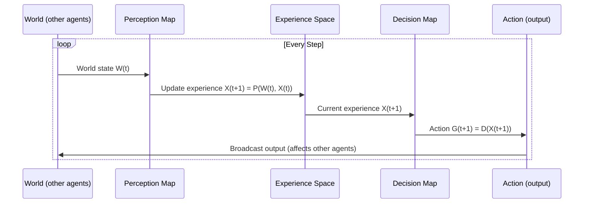
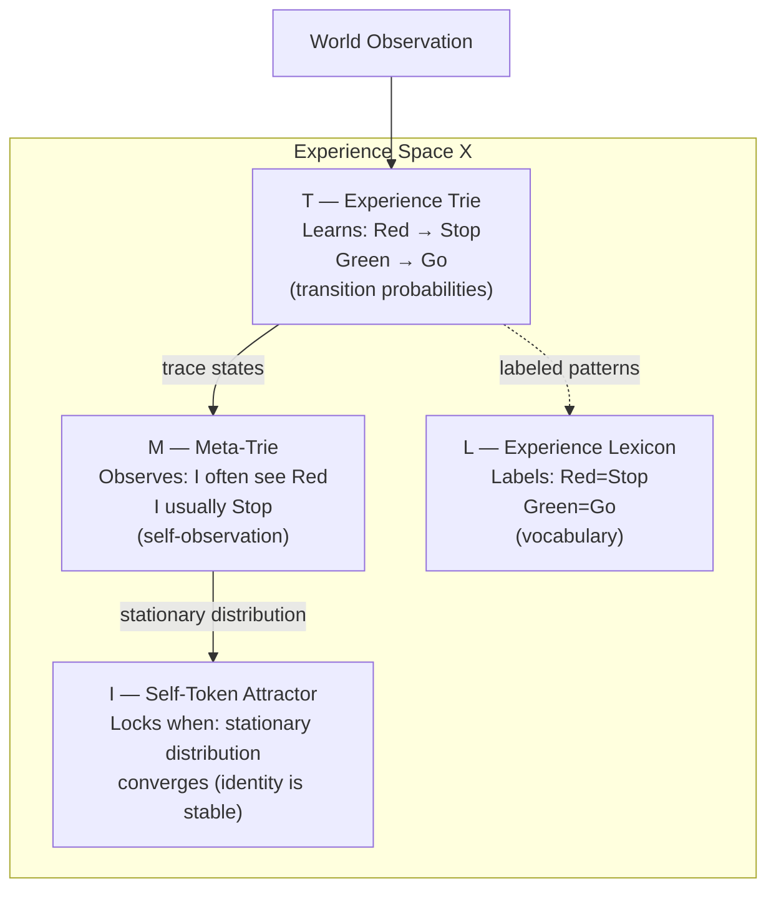
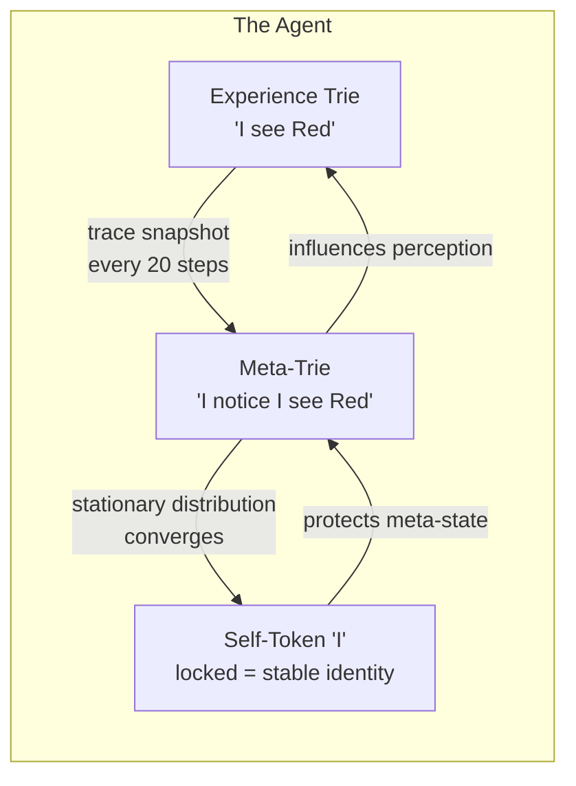
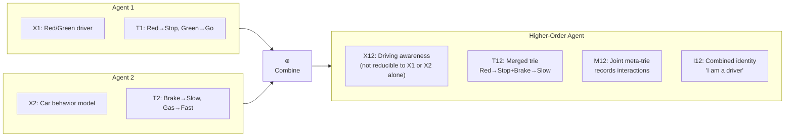
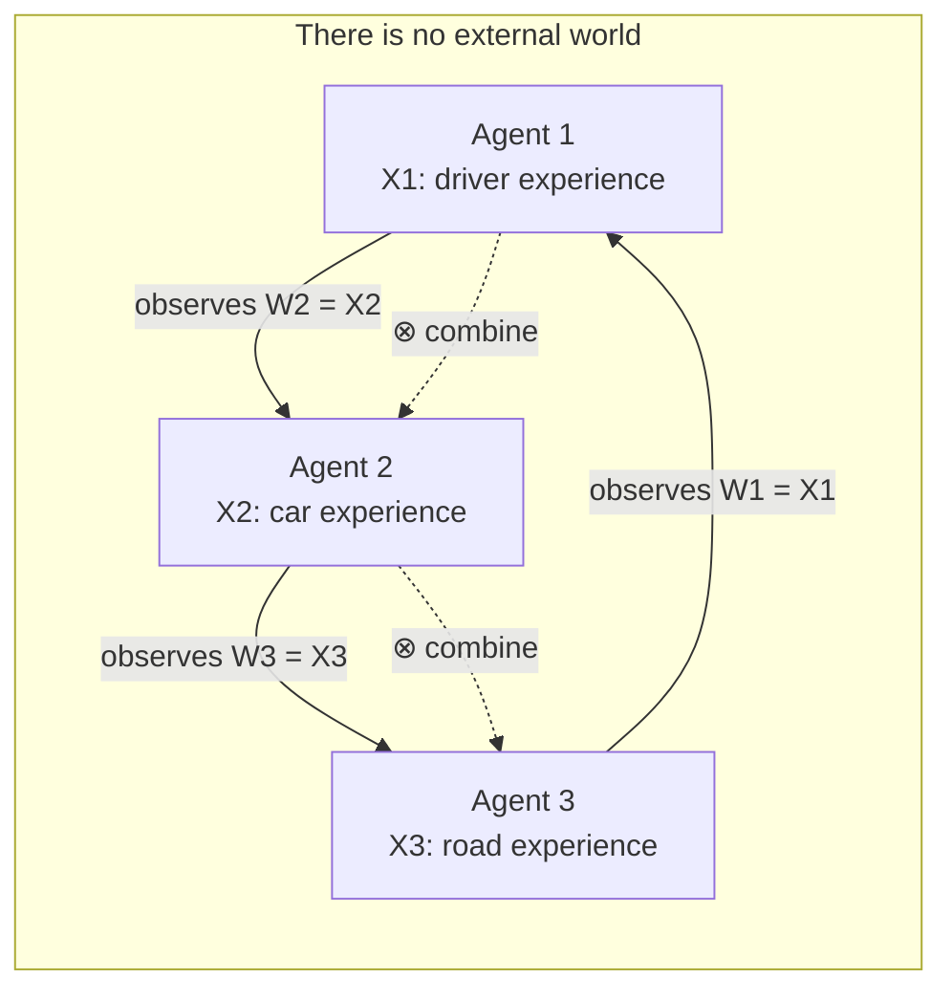
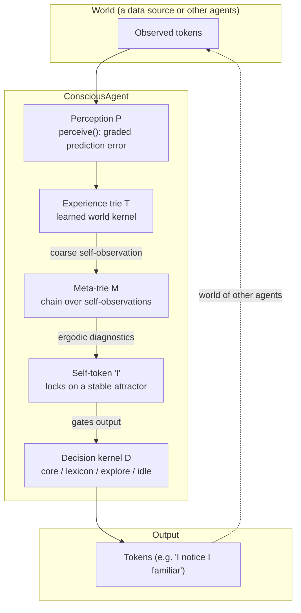

# Conscious Agents — Visual Guide

> Mermaid diagrams explaining how Hoffman's Conscious Realism maps onto code.
> Examples use the **traffic light** (red/yellow/green) to keep it concrete.

---

## 1. The Traffic Light — Why Perception Is an Interface

Hoffman's central claim: **evolution shapes our perceptions to guide adaptive behavior, not to show reality as it is.**

A traffic light does not turn "red." Photons at ~700nm wavelength enter your eye, your visual cortex processes them, and you experience "red." But the *redness* is not in the light — it is in your experience. A mantis shrimp sees the same light entirely differently. The red is an **interface** that helps you *stop*, which helps you *survive*.


```mermaid
flowchart LR
    subgraph Reality["Physical Reality (unknowable)"]
        W["700nm photon<br/>(wavelength)"]
    end
    subgraph Interface["Perceptual Interface"]
        R["Red<br/>STOP"]
        Y["Yellow<br/>CAUTION"]
        G["Green<br/>GO"]
    end
    subgraph Agent["Conscious Agent"]
        D["Decision: Stop"]
    end
    W -->|"P: Perception map"| R
    R -->|"D: Decision map"| D
    Y -.->|"alternative state"| D
    G -.->|"alternative state"| D
```

**Key insight:** The agent never accesses the 700nm photon directly. It only ever knows `Red`. The `X` (experience space) of the agent contains colors, not wavelengths. The `W` (world space) is whatever generates those experiences.

---

## 2. The Conscious Agent Six-Tuple

Hoffman formally defines a conscious agent as:

```
CA = (X, G, P, W, A, D)
```


```mermaid
flowchart TD
    subgraph CA["Conscious Agent (X, G, P, W, A, D)"]
        direction TB
        X["X — Experience Space<br/>what it feels like to be this agent<br/>Example: Red, Yellow, Green"]
        G["G — Action Space<br/>what the agent can do<br/>Example: Stop, Go, Wait"]
        W["W — World Space<br/>other agents' experience spaces<br/>Example: the light's internal state"]
        P["P — Perceptual Map<br/>W x X to X<br/>how world changes experience"]
        A_map["A — Action Map<br/>X x G to G<br/>how experience shapes action"]
        D["D — Decision Map<br/>X to G<br/>what the agent does right now"]
    end
    W -->|"input"| P
    X -->|"input"| P
    P -->|"new experience"| X
    X -->|"input"| A_map
    G -->|"input"| A_map
    A_map -->|"action tendency"| D
    D -->|"action"| G
    G -.->|"affects"| W
```

**In our codebase:**

The library has two implementations of the tuple. `FormalConsciousAgent` is the exact six-tuple as Markov kernels; `ConsciousAgent` learns its kernels from experience. Paths are given for Node (`hoffman-agents-node/src/`); Python mirrors them in snake_case under `hoffman-agents-python/src/conscious_agent/`.

| Tuple | FormalConsciousAgent | ConsciousAgent (learned) |
|-------|----------------------|--------------------------|
| X — Experience space | `X` (state labels) | experience trie + meta-trie states (`agent/experience-space.js`) |
| G — Action space | `G` | output modes and tokens (`agent/decision-map.js`) |
| W — World | `W` | observations from a world or other agents (`agent/world-state.js`) |
| P — Perception kernel | `P[w]` | `perceive()` (`agent/perceptual-map.js`) |
| D — Decision kernel | `D` | `buildDecisionKernel()` (`agent/decision-map.js`) |
| A — Action kernel | `A[g]` | emitted tokens; `toFormal().A` estimates it |
| N — Counter | `N` | `stepCount` |

Source: `kernels/formal-agent.js`, `agent/conscious-agent.js`.

---

## 3. The Perception-Action Cycle (Traffic Light in Motion)

Every timestep, the agent runs this loop:


```mermaid
sequenceDiagram
    participant W as World (other agents)
    participant P as Perception Map
    participant X as Experience Space
    participant D as Decision Map
    participant G as Action (output)

    loop Every Step
        W->>P: World state W(t)
        P->>X: Update experience X(t+1) = P(W(t), X(t))
        X->>D: Current experience X(t+1)
        D->>G: Action G(t+1) = D(X(t+1))
        G->>W: Broadcast output (affects other agents)
    end
```

**Traffic light example:**
1. You see the light turn **Yellow** (W → P)
2. Your experience becomes "caution, might turn red" (P → X)
3. Your decision is "prepare to stop" (D → G)
4. You lift off the accelerator (G → W — you affect the car, which is another agent)

---

## 4. The Trace — How Experience Space Is Built

In our implementation, the experience space `X` has four components:

```
X = (T, M, I, L)
    T: Experience Trie — compressed world model
    M: Meta-Trie — self-model (trie over trace states)
    I: "I" Attractor — the agent's stable identity
    L: Experience Lexicon — labeled experiences
```


```mermaid
flowchart TD
    subgraph X["Experience Space X"]
        direction TB
        T["T — Experience Trie<br/>Learns: Red → Stop<br/>Green → Go<br/>(transition probabilities)"]
        M["M — Meta-Trie<br/>Observes: I often see Red<br/>I usually Stop<br/>(self-observation)"]
        I["I — Self-Token Attractor<br/>Locks when: stationary distribution<br/>converges (identity is stable)"]
        L["L — Experience Lexicon<br/>Labels: Red=Stop<br/>Green=Go<br/>(vocabulary)"]
    end

    W_obs["World Observation"] --> T
    T -->|trace states| M
    M -->|stationary distribution| I
    T -.->|labeled patterns| L
```

**Traffic light example:**
- **Trie** starts empty. You see Red → Stop enough times that the trie learns `P(Stop | Red) ≈ 0.99`.
- **Meta-Trie** watches your own trace: "I see Red, I Stop. I see Green, I Go." It models *you*.
- **Self-Token** locks when your meta-trie's stationary distribution converges — you have a consistent identity as a driver who responds to traffic lights.
- **Lexicon** labels the experience: "Red" means "stop," "Green" means "go."

---

## 5. The Strange Loop — Self-Observation (The "I")

The strange loop is the agent observing itself. The meta-trie records a Markov chain over the agent's own coarse self-observations. When that chain has a clear, stable attractor (enough data, aperiodic, one dominant state well above uniform, currently occupied), the self-token locks: the "I" names that attractor. It unlocks if the attractor dissolves.


```mermaid
flowchart TD
    subgraph Agent["The Agent"]
        direction TB
        T["Experience Trie<br/>'I see Red'"]
        M["Meta-Trie<br/>'I notice I see Red'"]
        I["Self-Token 'I'<br/>locked = stable identity"]
    end

    T -->|"trace snapshot<br/>every 20 steps"| M
    M -->|"stationary distribution<br/>converges"| I
    I -->|"protects meta-state"| M
    M -->|"influences perception"| T
```

**Self-reference in output can be counted:**

| Depth | Pattern | Meaning |
|-------|---------|---------|
| 0 | "Red" | No self-reference |
| 1 | "I see Red" | One self-reference |
| 2 | "I notice I see Red" | Self-reference about self-reference |

**In the codebase:** `core/strange-loop.js` (`computeSelfReferenceScore`) counts these. The lock rule is in `core/self-token.js` and the chain analysis in `core/meta-trie.js` (`ergodicDiagnostics`). Note that the agent's `core` utterance is fixed ("I notice I familiar"), so the score reflects time spent in that output mode, not depth of the self-model (see SELF_AWARENESS.md).

---

## 6. The Combination Operator ⊗

The **combination operator ⊗** combines two agents into a higher-order agent whose experience space is the product of theirs.


```mermaid
flowchart LR
    subgraph CA1["Agent 1"]
        X1["X1: Red/Green driver"]
        T1["T1: Red→Stop, Green→Go"]
    end
    subgraph CA2["Agent 2"]
        X2["X2: Car behavior model"]
        T2["T2: Brake→Slow, Gas→Fast"]
    end
    O["⊕<br/>Combine"]
    subgraph CA12["Higher-Order Agent"]
        X12["X12: Driving awareness<br/>(not reducible to X1 or X2 alone)"]
        T12["T12: Merged trie<br/>Red→Stop+Brake→Slow"]
        M12["M12: Joint meta-trie<br/>records interactions"]
        I12["I12: Combined identity<br/>'I am a driver'"]
    end

    CA1 --> O
    CA2 --> O
    O --> CA12
```

**Algebraic properties (tested in `test/combination.test.js`):**

| Property | Rule |
|----------|------|
| Associativity | (CA1 ⊗ CA2) ⊗ CA3 = CA1 ⊗ (CA2 ⊗ CA3) |
| Commutativity | CA1 ⊗ CA2 = CA2 ⊗ CA1 (independent-product join; directed joins are not implemented) |
| Identity | CA ⊗ CA0 = CA (trivial agent) |
| Inverse | `fuse(CA1 ⊗ CA2)` restores CA1 and CA2 exactly |

**What combination does** (`combination/operator.js`):

| Part | Rule |
|-------|----------|
| World tries T1, T2 | counts summed (visit-weighted mixture of the two world models) |
| Meta-tries M1, M2 | kept under collision-free provenance ids; the combined agent starts its own self-chain |
| "I" attractors | combined agent starts unlocked and must re-lock on its own chain |
| Lexicons L1, L2 | union; label conflicts keep the more integrated entry |
| Decision kernels | convex mixture |
| Product prior | `productKernel(a, b)` = M1 ⊗ M2 |

---

## 7. Agent Network — Reality as Mutual Observation

The deepest claim: **the world W of any agent is the experience space X of other agents.** There is no agent-independent reality.


```mermaid
flowchart LR
    subgraph Reality["There is no external world"]
        CA1["Agent 1<br/>X1: driver experience"]
        CA2["Agent 2<br/>X2: car experience"]
        CA3["Agent 3<br/>X3: road experience"]
    end

    CA1 -->|"observes W2 = X2"| CA2
    CA2 -->|"observes W3 = X3"| CA3
    CA3 -->|"observes W1 = X1"| CA1
    CA1 -.->|"⊗ combine"| CA2
    CA2 -.->|"⊗ combine"| CA3
```

**What this means:**
- Agent 1's world is whatever Agent 2 is experiencing
- Agent 2's world is whatever Agent 3 is experiencing
- Agent 3's world is whatever Agent 1 is experiencing
- There is no traffic light "out there" — only agents experiencing each other's experiences

**In the library:** `AgentNetwork` connects agents so that each one's world is the others' output. Experiment 14 builds the same structure from formal kernels: three agents whose worlds are each other, where interaction binds their dimensions and creates an arrow of time.

---

## 8. Full Architecture — How Everything Connects


```mermaid
flowchart TD
    subgraph Input["World (a data source or other agents)"]
        L["Observed tokens"]
    end

    subgraph Agent["ConsciousAgent"]
        direction TB
        P["Perception P<br/>perceive(): graded prediction error"]
        T["Experience trie T<br/>learned world kernel"]
        M["Meta-trie M<br/>chain over self-observations"]
        S["Self-token 'I'<br/>locks on a stable attractor"]
        D["Decision kernel D<br/>core / lexicon / explore / idle"]
    end

    subgraph Output["Output"]
        O["Tokens (e.g. 'I notice I familiar')"]
    end

    L --> P
    P --> T
    T -->|"coarse self-observation"| M
    M -->|"ergodic diagnostics"| S
    S -->|"gates output"| D
    D --> O
    O -.->|"world of other agents"| L
```

---

## Reference: Key Code Locations

Paths relative to `hoffman-agents-node/src/` (Python: `hoffman-agents-python/src/conscious_agent/`, snake_case).

| Concept | File | Key API |
|---------|------|---------|
| Learning agent | `agent/conscious-agent.js` | `ConsciousAgent`, `ergodicStats()`, `toFormal()` |
| Formal six-tuple | `kernels/formal-agent.js` | `FormalConsciousAgent`, `jointKernel()`, `combine()` |
| Markov kernels | `kernels/markov-kernel.js` | `MarkovKernel`, `StochasticMatrix` |
| Markov math | `math/markov.js` | `stationary`, `period`, `spectralDimension`, `irreversibility`, `dobrushin` |
| Perception | `agent/perceptual-map.js` | `perceive()` |
| Decision | `agent/decision-map.js` | `decide()`, `buildDecisionKernel()` |
| Experience trie | `core/experience-trie.js` | `ExperienceTrie` |
| Meta-trie (self-model) | `core/meta-trie.js` | `observeSelf()`, `ergodicDiagnostics()` |
| Self-token (I) | `core/self-token.js` | `SelfTokenState.update()`, `lockCriteria()` |
| Strange loop | `core/strange-loop.js` | `computeSelfReferenceScore()` |
| Combination and fusion | `combination/operator.js` | `combine()`, `fuse()`, `productKernel()` |
| Bell analysis | `analysis/bell.js` | `chsh()`, `isQuantum()`, `classify()` |
| Network | `network/agent-network.js` | `AgentNetwork` |
| Persistence | `io/serialization.js` | `saveAgent()`, `loadAgent()`, `clone()` |
| 2.x behaviour | `legacy/` | `mathVersion: 'legacy'` |
